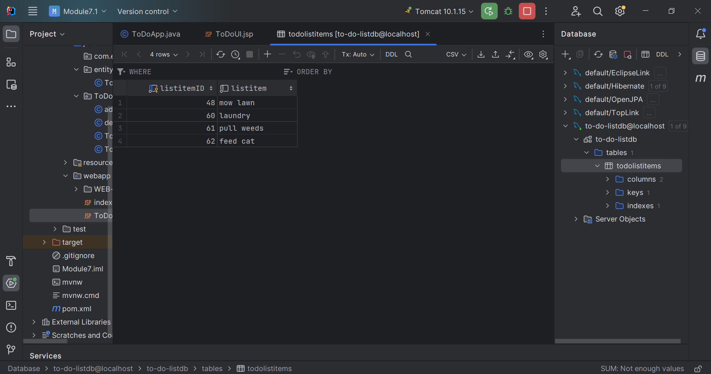

# Software Development 2 - To-Do List App

To-Do List App created for Software Development 2  

## Table of contents

- [Overview](#overview)
  - [The challenge](#the-challenge)
  - [Screenshot](#screenshot)
- [My process](#my-process)
  - [Built with](#built-with)
- [Author](#author)

## Overview

### The challenge

Users should be able to:

- Add to-do list items
- Delete to-do list items
- View to-do list items

### Screenshot

 

## My process

For this class, we created the application in different stages. First, I created the basic structure of the application in Java, then added a database in MySQL with Hibernate,
and finally created the UI with JSP and Bootstrap.

### Built with

- Java
- JSP (Java Server Pages)
- Bootstrap
- Hibernate

## Author

- Website - Gabriela Cardenas (https://github.com/gcardenasdev)

